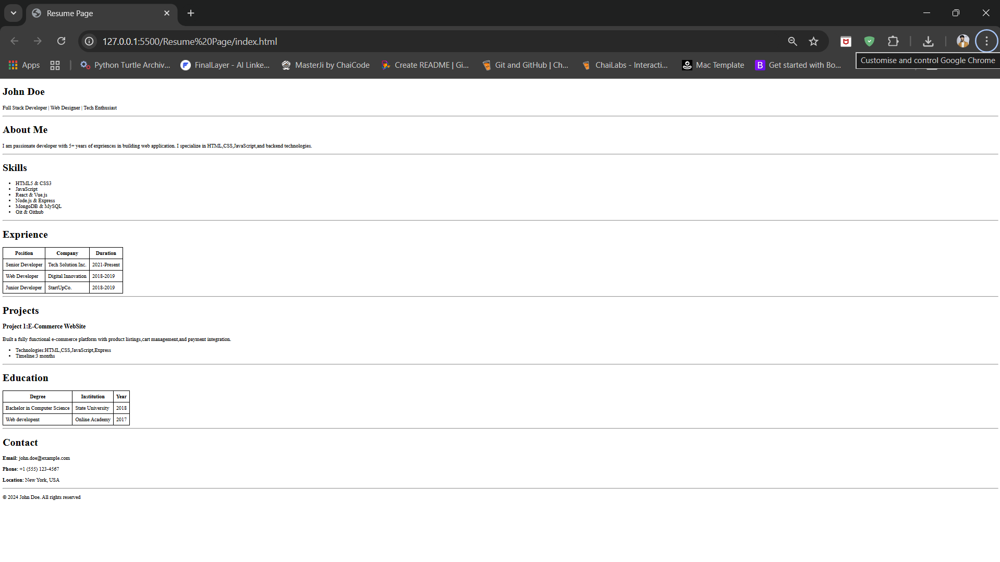

# Resume Page Project

A simple, clean HTML resume page showcasing professional information including experience, skills, education, and projects.

## 📋 Table of Contents
- [Features](#features)
- [Screenshot](#screenshot)
- [Setup Instructions](#setup-instructions)
- [Usage](#usage)
- [Project Structure](#project-structure)
- [Technologies Used](#technologies-used)
- [Customization](#customization)

## ✨ Features

- **Personal Information**: Name, title, and professional summary
- **About Section**: Brief introduction and background
- **Skills List**: Technical skills and competencies
- **Experience Table**: Professional work history with positions, companies, and durations
- **Projects Showcase**: Detailed project descriptions with technologies used
- **Education Table**: Academic qualifications and certifications
- **Contact Information**: Email, phone, and location details
- **Responsive Design**: Clean, simple layout with table-based data presentation

## 📸 Screenshot



## 🚀 Setup Instructions

### Prerequisites
- A modern web browser (Chrome, Firefox, Safari, Edge, etc.)
- No additional software or dependencies required!

### Installation

1. **Clone or Download the Repository**
   ```bash
   git clone <repository-url>
   cd "cohort assignemt"
   ```

   Or simply download the ZIP file and extract it.

2. **Navigate to the Project Folder**
   ```bash
   cd "Resume Page"
   ```

3. **Open the Resume Page**
   - Simply double-click on `index.html`, or
   - Right-click on `index.html` and select "Open with" → your preferred browser

That's it! No build process, no dependencies, no installation required.

## 💻 Usage

### Viewing the Resume

1. Open `Resume Page/index.html` in any web browser
2. The page will display a complete resume with all sections

### Editing the Content

To customize the resume with your own information:

1. Open `Resume Page/index.html` in any text editor (VS Code, Notepad++, Sublime Text, etc.)
2. Modify the content within the HTML tags:
   - **Name & Title**: Edit the `<h1>` and `<p>` tags in the Intro section (lines 18-19)
   - **About Me**: Update the paragraph in the About section (line 24)
   - **Skills**: Add/remove `<li>` items in the Skills list (lines 30-35)
   - **Experience**: Modify table rows in the Experience section (lines 48-62)
   - **Projects**: Update project details (lines 69-75)
   - **Education**: Edit table rows in the Education section (lines 87-96)
   - **Contact**: Update email, phone, and location (lines 104-106)

3. Save the file and refresh your browser to see the changes

## 📁 Project Structure

```
cohort assignemt/
├── Resume Page/
│   └── index.html          # Main resume page
├── screenshot.png          # Preview screenshot
└── README.md              # This file
```

## 🛠️ Technologies Used

- **HTML5**: Semantic markup and structure
- **CSS3**: Inline styles for table formatting
- **No JavaScript**: Pure HTML/CSS implementation
- **No External Dependencies**: Completely self-contained

## 🎨 Customization

### Styling

The current design uses minimal inline CSS for table borders. To customize the appearance:

1. **Modify Existing Styles** (lines 8-12):
   ```css
   table, th, td {
       border: 1px solid black;
       border-collapse: collapse;
       padding: 8px;
   }
   ```

2. **Add More Styles**: You can add additional CSS rules in the `<style>` section to customize:
   - Colors and fonts
   - Spacing and layout
   - Background colors
   - Hover effects
   - Responsive breakpoints

### Adding New Sections

To add a new section:

1. Follow the existing pattern:
   ```html
   <h1>Section Title</h1>
   <p>Section content...</p>
   <hr>
   ```

2. Place it before the copyright footer (line 109)

### Table Customization

To modify tables (Experience, Education):
- Add new rows: Copy an existing `<tr>...</tr>` block and modify the content
- Add new columns: Add `<th>` in the header row and corresponding `<td>` in data rows
- Remove columns: Delete the corresponding `<th>` and `<td>` elements

## 📝 License

© 2024 John Doe. All rights reserved.

---

**Note**: This is a simple static HTML resume page designed for easy customization and deployment. Feel free to modify it according to your needs!

